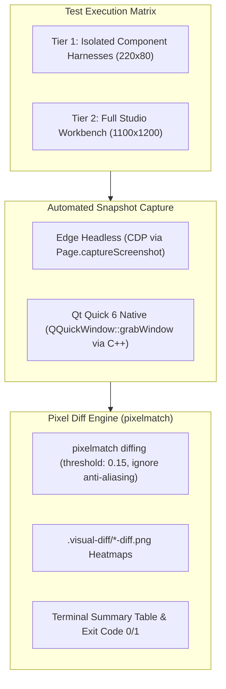

# Cross-Stack Visual Conformance & Automated Pixel Diff Architecture

> **Authority Level**: `[Authoritative Specification]`
> **Scope**: React & Qt Quick cross-stack pixel-level rendering conformance, snapshot capture automation, and visual regression gating.

---

## 1. Overview & Core Mission

`cha-set` is designed to guarantee **100% pixel-level, dimensional, and behavioral parity** across different rendering stacks (React web UI and Qt Quick native C++/QML).

Because subjective manual inspection is insufficient for maintaining true parity, `cha-set` introduces an **Automated Visual Regression & Pixel Diff Quality Pipeline** (`pnpm test:visual` / `pnpm gate:visual`).

---

## 2. Two-Tier Verification Architecture

### Tier 1: Isolated Component Harness
- **Viewport**: Deterministic fixed bounding box (220x80 px).
- **React Route**: `/?harness=<component>&variant=<v>&size=<s>&label=<l>&disabled=<b>`
- **Qt CLI**: `QtChaSetDemo.exe --harness <component> --variant <v> --size <s> --label <l> --shot <path>`
- **Threshold**: `maxDiffPercent: 3.5%` (accounting purely for font rasterization anti-aliasing between Chromium Blink and Qt FreeType/DirectWrite, with 0px bounding box or layout displacement).

### Tier 2: Full Studio Workbench Integration
- **Viewport**: 1100x1200 px.
- **Coverage**: Full Studio Workbench with Sidebar (200px), Top Header (60px), Theme Tuner Card, 2-Column Interactive Sandbox, Full Variant Matrix, Token Swatches, Typography/Radius/Chart cards, and Export Dialog.
- **Threshold**: `maxDiffPercent: 6.0%`.

---

## 3. Tooling & Commands

| Command | Purpose |
| :--- | :--- |
| `pnpm test:visual` | Runs full test matrix across React and Qt, outputs diff heatmaps to `.visual-diff/`, and prints conformance table. |
| `pnpm gate:visual` | CI/pre-commit gate checking visual conformance; fails with exit code 1 on regression. |
| `node scripts/run-qt-showcase.mjs` | Launches interactive Qt Studio Showcase. |

---

## 4. Visual Conformance Invariants

1. **Dimensional Invariance**: Every button height, padding, gap, and corner radius must match bit-exact between React and Qt (`sm: 32px`, `md: 36px`, `lg: 40px`, `radius: 6px`).
2. **Color Token Parity**: Every color state (`primary`, `secondary`, `destructive`, `ghost`, `hover`, `active`, `disabled`) resolves to identical RGB values across both engines.
3. **No Phantom Offsets**: Sub-elements (e.g. loading spinners) must collapse to `width: 0` when inactive so they never introduce horizontal shifts.
